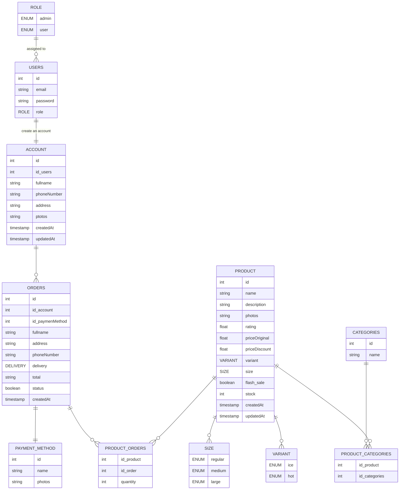

```mermaid
erDiagram
ROLE {
    ENUM admin
    ENUM user
    }

SIZE {
    ENUM regular
    ENUM medium
    ENUM large
}

VARIANT {
    ENUM ice
    ENUM hot
}

USERS {
    int id
    string email
    string password
    ROLE role
    }

ACCOUNT {
    int id
    int id_users
    string fullname
    string phoneNumber
    string address
    string ptotos
    timestamp createdAt
    timestamp updatedAt
}

ORDERS {
    int id
    int id_account
    int id_paymenMethod
    string fullname
    string address
    string phoneNumber
    DELIVERY delivery
    string total
    boolean status 
    timestamp createdAt
}

PAYMENT_METHOD {
    int id
    string name
    string photos
}


PRODUCT {
    int id
    string name
    string description
    string photos
    float rating
    float priceOriginal
    float priceDiscount
    VARIANT variant
    SIZE size
    boolean flash_sale
    int stock
    timestamp createdAt
    timestamp updatedAt
}

CATEGORIES {
    int id
    string name
}

PRODUCT_CATEGORIES {
    int id_product
    int id_categories
}

PRODUCT_ORDERS {
   int id_product
   int id_order
   int quantity
}


    ROLE ||--o{ USERS : "assigned to"
    USERS ||--|| ACCOUNT : "create an account"
    CATEGORIES||--o{ PRODUCT_CATEGORIES : ""

    PRODUCT ||--o{SIZE: ""
    PRODUCT ||--o{VARIANT : ""
    PRODUCT ||--o{PRODUCT_CATEGORIES :""
    
    ORDERS ||--||PAYMENT_METHOD:""
    ACCOUNT ||--o{ORDERS :""

    ORDERS ||--o{PRODUCT_ORDERS: ""
    PRODUCT ||--o{PRODUCT_ORDERS :""


```